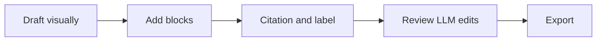

# ScieMD Tutorial

**Write once. Read beautifully. Review safely. Export when ready.**

Welcome to **ScieMD**, a local-first Markdown writing app by **Scienfy** for scientific papers, lab notes, research statements, and LLM-assisted revision. The saved file stays readable Markdown. The app adds visual editing, document intelligence, references, variables, review markers, and styled export on top of that source.

:::important {#imp-first-twenty}
Start here: change the **Style** in the top bar, select this sentence and right-click to add an **LLM note**, then open **References** or **Data** in the left sidebar. All of that still lives in one `.md` file.
:::

The core idea is practical:

- Humans need a calm writing surface with headings, tables, equations, figures, citations, and readable review state.
- LLMs need clean structure so they can preserve labels, citations, variables, locked sections, LLM notes, and text versions.
- Exports need the same visual styling you approved in the app, not a separate stale layout.

:::important {#imp-markdown-bridge}
The Markdown file is the source of truth. Visual mode, Source mode, the inspector, Note to LLM markers, HTML, DOCX, and PDF are coordinated views or outputs from that source.
:::

This tutorial is safe to edit. If you press **Save** while reading the built-in welcome page, ScieMD asks where to save your own copy. A fresh app launch can still start from the original tutorial.

On a fresh profile, ScieMD first asks **What are you writing?** Choose a document type to tune width, spacing, and style defaults, or choose **Skip** to keep the standard ScieMD defaults. This does not change the Markdown syntax or lock you into a template.

## Document Directory

Use this directory, the left **Outline** tab, or `Ctrl+K` to jump around.

1. [First Tour](#1-first-tour)
2. [The Main Screen](#2-the-main-screen)
   - [Top Bar](#21-top-bar)
   - [Formatting Toolbar](#22-formatting-toolbar)
   - [Left Sidebar](#23-left-sidebar)
   - [Right Inspector And Feature Rail](#24-right-inspector-and-feature-rail)
   - [Status Bar](#25-status-bar)
3. [Visual And Source Modes](#3-visual-and-source-modes)
4. [Fast Commands](#4-fast-commands)
5. [Scientific Blocks](#5-scientific-blocks)
6. [Math, Figures, Mermaid, SVG, And Images](#6-math-figures-mermaid-svg-and-images)
7. [Citations, Labels, And Bibliographies](#7-citations-labels-and-bibliographies)
8. [Variables And Data Sources](#8-variables-and-data-sources)
9. [LLM-Safe Review](#9-llm-safe-review)
10. [Text Versions](#10-text-versions)
11. [Focus, Width, Styles, And Themes](#11-focus-width-styles-and-themes)
12. [Export To HTML, PDF, And DOCX](#12-export-to-html-pdf-and-docx)
13. [Practice Checklist](#13-practice-checklist)

## 1. First Tour

Try this path before reading everything:

1. Stay in **Visual** mode and type a sentence below this list.
2. Click **Style** and switch among Scientific, Journal, Lab, Code, Codex, Scienfy, Science, and Nature.
3. Click **Theme** and try Light, Dark, Sepia, or System.
4. Press `Ctrl+K`, search `focus`, and toggle focus mode.
5. Click a blank paragraph and type `/` to open insert actions.
6. Insert a **Block**, choose **Note** or **Important**, then double-click the rendered block to edit it.
7. Select text, right-click, and choose **Add LLM note for this text**.
8. Select another sentence, right-click, and choose **Create locked section**.
9. Switch to **Source** to inspect the Markdown comments and directives.
10. Open **Export** and choose **Styled HTML**, **PDF - current style/theme**, **Word DOCX - current style/theme**, or **Print preview** when you want output.

:::tip {#tip-first-tour}
Use `Ctrl+K` as the map. You can search commands, headings, citations, style options, export actions, and panel toggles without memorizing where every button lives.
:::

## 2. The Main Screen

### 2.1 Top Bar

The top bar follows a familiar app menu shape:

| Area | What it does |
| --- | --- |
| **File** | New, templates, open/recent files, save, export, and print preview. |
| **Edit** | Undo/redo, Find/Replace, rich-text copy, and scientific typography cleanup. |
| **View** | Visual/Source mode, sidebar tabs, inspector, focus mode, theme, visual style, and font size. |
| **Insert** | Links, images, citations, variables, diagrams, semantic blocks, locked sections, LLM notes/instructions, and versions. |
| **Format** | Headings, inline emphasis/code, tables, blockquotes, and scientific typography. |
| **References** | Citation management, bibliography reload/sync, and the auto References section. |
| **LLM** | Paste review for external LLM edits and ScieMD LLM skill instructions. |
| **Tools** | Command palette, settings, external-tool checks, Inkscape path, and export log. |
| **Help** | Quick tour, full tutorial, shortcuts, About, GitHub, and bug reporting. |
| **K button / `Ctrl+K`** | Opens the command palette. |
| **Visual / Source** | Switches between rendered editing and exact Markdown. |
| **Style shortcut** | Opens the focused style picker so you can change document appearance without changing the saved Markdown. |
| **Settings** | In Tools > Settings, adjust theme, visual style, font size, writing surface, and local tool paths. |
| **Focus / sidebar / inspector icons** | Toggles quiet writing, the left navigation sidebar, and the right inspector. |

:::note {#nte-style-separation}
Style and theme are presentation settings. Your Markdown does not become a different file when you switch from Scienfy to Journal or Nature.
:::

### 2.2 Formatting Toolbar

The toolbar below the top bar inserts common Markdown:

| Button | Use |
| --- | --- |
| **Undo / Redo** | Step editing history backward or forward |
| **H1 / H2 / H3-H6** | Headings and subsections |
| **B / I / code** | Bold, italic, and inline code |
| **Link** | URL links |
| **List / Numbered / Task** | Bullet, ordered, and task lists |
| **Quote / Code block** | Blockquotes and fenced source snippets |
| **Table** | GFM tables |
| **M / $$** | Inline and display math |
| **Fn** | Footnotes |
| **Fig** | A labeled figure block |
| **Citation** | Citation picker and creator |
| **Image** | Image insertion |
| **HR** | Horizontal rule |

### 2.3 Left Sidebar

The left sidebar has four tabs:

- **Files**: choose a folder and browse Markdown, text, and image files.
- **Outline**: jump to headings in the current document.
- **References**: inspect citation usages, loaded BibTeX entries, labels, and missing keys.
- **Data**: inspect and edit variables from front matter or linked JSON/CSV files.

### 2.4 Right Inspector And Feature Rail

The right **Inspector** is where ScieMD summarizes document state:

- **Submission readiness**: score, counts, and open manuscript issues.
- **LLM review**: review pasted changes and toggle session authorship shading.
- **LLM controls**: counts and examples of locked sections, LLM notes, LLM instructions, text versions, and bibliography entries.
- **Scientific paper**: title, front matter, bibliography, citations, labels, references, variables, semantic blocks, and text versions.
- **Validation**: warnings and source-mode-only blockers.
- **Document**: path, save state, style, width, line endings, images, tables, code blocks, and Inkscape status.
- **Recent files**: quick reopen list.

The slim feature rail near the editor edge gives quick jumps to review markers such as locked sections, LLM notes, citations, labels, and variables.

### 2.5 Status Bar

The bottom status bar stays compact. It shows save state, current context, word count, readiness, and issue indicators. If something looks wrong, check the status bar and inspector first.

## 3. Visual And Source Modes

ScieMD has two coordinated views:

- **Visual**: best for writing, reading, rearranging, and reviewing. Blocks, math, variables, LLM notes, text versions, Mermaid, SVG, and figures render in place.
- **Source**: best for exact Markdown control. Use it to inspect front matter, fenced code, `:::` directives, and ScieMD comments.

:::callout {#callout-mode-philosophy}
Visual and Source are not separate documents. A change in one view updates the same Markdown file.
:::

## 4. Fast Commands

### Command Palette

Press `Ctrl+K` or click the top-bar **K** button. Useful searches:

| Search | Finds |
| --- | --- |
| `new paper`, `lab note`, `research statement` | Starter templates |
| `export` | Styled HTML, PDF, and DOCX export |
| `lock`, `note`, `version` | LLM-safe review commands |
| `citation`, `bibliography` | Citation insertion and generated bibliography sync |
| `mermaid`, `svg`, `variable` | Scientific insertion helpers |
| `readiness`, `checklist` | Submission readiness report |
| `style`, `theme`, `width`, `font` | Presentation controls |
| a heading title | Jump to that section |
| `@key` | Citation-aware dynamic commands when BibTeX keys are loaded |

### Slash Menu

In the editor, click an empty paragraph and type `/`. The slash menu currently includes:

| Command | Inserts |
| --- | --- |
| **Block** | Figure, note, callout, tip, important, warning, or result block |
| **Table** | A table with selectable size |
| **Variable** | A `{{ variable_name }}` placeholder |
| **Citation** | A citation marker |
| **Code fence** | Fenced code |
| **Mermaid diagram** | A rendered Mermaid flowchart fence |
| **SVG figure** | A labeled figure containing editable SVG |
| **Quote** | Blockquote |

### Right-Click Selection Actions

Select text and right-click to:

- add a Note to LLM on the exact text that needs revision,
- add a Note to Human for review context,
- create a locked section,
- create text versions,
- wrap the selection as a semantic block.

### Find And Replace

Use `Ctrl+F` or the search icon. App-level Find/Replace works inside the editor and reports locked-section matches so you do not accidentally rewrite protected text.

## 5. Scientific Blocks

Semantic blocks make a document easier to scan and safer to revise. They are stored as Markdown `:::` directives.

:::result {#tbl-block-types}
| Block | Use it for | Visual intention |
| --- | --- | --- |
| `figure` | Images, Mermaid diagrams, SVG, captions | Evidence with a stable label |
| `result` | Findings, measurements, summary tables | Output or observation |
| `note` | Neutral supporting context | Extra information |
| `callout` | Key takeaway | Highlighted idea |
| `tip` | Practical recommendation | Helpful next step |
| `important` | High-priority claim | Do not miss it |
| `warning` | Caveat, risk, limitation | Slow down and inspect |
:::

To edit a rendered block, double-click it or use its visible **Edit** control. Use **Apply** to commit the change, **Cancel** to leave it alone, or **Delete block** when the block should be removed.

:::warning {#wrn-block-discipline}
Use warnings for real caveats: missing controls, ambiguous statistics, unsupported claims, or venue-specific submission risks.
:::

## 6. Math, Figures, Mermaid, SVG, And Images

Math can be inline, such as $\sigma = \sqrt{\frac{1}{N}\sum_i(x_i-\mu)^2}$, or displayed:

$$
\sigma = \sqrt{\frac{1}{N}\sum_{i=1}^{N}(x_i - \mu)^2}
$$

Figures can contain images, captions, tables, Mermaid diagrams, or SVG vector drawings. Mermaid diagrams are useful for quick process maps:



SVG is useful when the figure should remain editable as text and still render as a vector figure.

:::figure {#fig-workflow}
```svg
<svg xmlns="http://www.w3.org/2000/svg" width="900" height="260" viewBox="0 0 900 260" preserveAspectRatio="xMidYMid meet" role="img" aria-label="SVG workflow in ScieMD">
  <defs>
    <marker id="arrow" viewBox="0 0 10 10" refX="8" refY="5" markerWidth="7" markerHeight="7" orient="auto-start-reverse">
      <path d="M 0 0 L 10 5 L 0 10 z" fill="#687076"/>
    </marker>
  </defs>
  <rect x="40" y="42" width="230" height="140" rx="18" fill="#eef4ff" stroke="#7892e8" stroke-width="2"/>
  <text x="155" y="77" text-anchor="middle" font-family="Scie Sans, sans-serif" font-size="20" font-weight="700" fill="#1f2a44">Markdown source</text>
  <text x="155" y="111" text-anchor="middle" font-family="JetBrains Mono, monospace" font-size="18" fill="#334155">&lt;svg&gt; ... &lt;/svg&gt;</text>
  <text x="155" y="143" text-anchor="middle" font-family="Scie Sans, sans-serif" font-size="16" fill="#475569">Readable by humans</text>
  <text x="155" y="164" text-anchor="middle" font-family="Scie Sans, sans-serif" font-size="16" fill="#475569">and LLMs</text>
  <path d="M 290 112 H 320" stroke="#687076" stroke-width="4" marker-end="url(#arrow)"/>
  <rect x="340" y="32" width="230" height="160" rx="20" fill="#f0faf3" stroke="#5aa469" stroke-width="2"/>
  <text x="455" y="68" text-anchor="middle" font-family="Scie Sans, sans-serif" font-size="20" font-weight="700" fill="#203824">Visual figure</text>
  <circle cx="405" cy="118" r="24" fill="#d8f3dc" stroke="#3a7d44" stroke-width="2"/>
  <circle cx="455" cy="118" r="24" fill="#d8f3dc" stroke="#3a7d44" stroke-width="2"/>
  <circle cx="505" cy="118" r="24" fill="#d8f3dc" stroke="#3a7d44" stroke-width="2"/>
  <path d="M 429 118 H 431 M 479 118 H 481" stroke="#3a7d44" stroke-width="3"/>
  <text x="455" y="166" text-anchor="middle" font-family="Scie Sans, sans-serif" font-size="16" fill="#31573a">Rendered live in Visual mode</text>
  <path d="M 590 112 H 620" stroke="#687076" stroke-width="4" marker-end="url(#arrow)"/>
  <rect x="640" y="42" width="220" height="140" rx="18" fill="#fff4db" stroke="#c48a2c" stroke-width="2"/>
  <text x="750" y="77" text-anchor="middle" font-family="Scie Sans, sans-serif" font-size="20" font-weight="700" fill="#4b3417">Inkscape</text>
  <path d="M 719 113 C 732 86, 768 86, 781 113 C 771 143, 730 143, 719 113 Z" fill="#ffe7ad" stroke="#9a6a1d" stroke-width="2"/>
  <circle cx="750" cy="114" r="12" fill="#ffffff" stroke="#9a6a1d" stroke-width="2"/>
  <text x="750" y="153" text-anchor="middle" font-family="Scie Sans, sans-serif" font-size="15" fill="#694a18">Optional vector editor</text>
  <text x="750" y="173" text-anchor="middle" font-family="Scie Sans, sans-serif" font-size="15" fill="#694a18">and PNG/PDF export</text>
  <text x="450" y="228" text-anchor="middle" font-family="Scie Sans, sans-serif" font-size="17" fill="#4b5563">One text block can be source, figure, and editable vector artwork.</text>
</svg>
```

This is a fenced `svg` block inside a figure. In Visual mode ScieMD sanitizes and renders it. If Inkscape is installed, SVG controls can open the drawing externally, apply the saved SVG back into the Markdown, or export PNG/PDF assets.
:::

Refer to the figure as @fig-workflow. The label stays stable even if the figure moves.

:::tip {#tip-figures}
Use meaningful labels such as `fig-workflow`, `tbl-results`, or `wrn-missing-control`. They make cross-references, inspector lists, and external LLM review easier to understand.
:::

## 7. Citations, Labels, And Bibliographies

This document declares a bibliography in front matter:

```yaml
bibliography: references.bib
```

Place `references.bib` next to the saved `.md` file. A citation looks like this: [@example2026].

Use the **Citation** toolbar button, the command palette, or the References sidebar to add and inspect citations. In Source mode, typing `[@` can offer citation autocomplete when BibTeX keys are loaded. The References sidebar also lists labels and missing keys.

Use labels for cross-references:

| Item | Label pattern | Reference pattern |
| --- | --- | --- |
| Figure | `fig-workflow` | `@fig-workflow` |
| Table or result | `tbl-block-types` | `@tbl-block-types` |
| Tip | `tip-figures` | `@tip-figures` |
| Warning | `wrn-block-discipline` | `@wrn-block-discipline` |
| Important | `imp-first-twenty` | `@imp-first-twenty` |

To create or refresh a managed bibliography section, press `Ctrl+K` and run **Sync generated bibliography**. To reread a changed `.bib` file without reopening the document, run **Reload bibliography from disk**.

## 8. Variables And Data Sources

Variables keep values from drifting away from analysis outputs. This tutorial defines these front matter variables:

| Variable | Rendered value |
| --- | --- |
| `{{ cohort_n }}` | {{ cohort_n }} |
| `{{ exp1_p_value }}` | {{ exp1_p_value }} |
| `{{ response_rate }}` | {{ response_rate }} |
| `{{ reactor_temp_c }}` | {{ reactor_temp_c }} |

Use `/variable`, the command palette, or the **Data** sidebar to insert or create variables. Known variables render in Visual mode. Missing variables are flagged in validation, and exports leave unresolved placeholders visible instead of silently inventing values.

You can also link a local JSON or CSV file generated by an analysis script:

```yaml
scienfy:
  variablesFile: results.json
```

Example `results.json`:

```json
{
  "cohort_n": 128,
  "exp1_p_value": 0.023,
  "reactor_temp_c": 405.2
}
```

Linked variable files refresh while the document is open. The Data sidebar can also save a front matter override when you need a document-level value.

:::important {#imp-variable-integrity}
If `{{ exp1_p_value }}` changes from `0.023` to `0.051`, you want the manuscript to show that change before submission. Variables make that check explicit.
:::

## 9. LLM-Safe Review

ScieMD is built for document-first LLM collaboration. You leave Note to LLM markers on the exact text that needs help, give an external LLM agent the ScieMD skill instructions, and let that agent edit the saved Markdown file. You do not need to restate every request in chat; the requests live in the document.

Keep ScieMD open while the external agent works. When the file changes on disk or an LLM revision is pasted back, ScieMD can show the incoming text edits for review so the human accepts or rejects manuscript changes instead of reading raw source diffs.

:::important {#imp-note-driven-review}
The LLM should treat Note to LLM markers as the task queue, remove completed LLM notes, add linked Note to Human summaries, preserve locks, use variables for repeated values, and create text versions when several valid rewrites are useful.
:::

### Locked Sections

Locks mark text that should survive an external LLM pass unchanged.

1. Select text.
2. Right-click.
3. Choose **Create locked section**.
4. Add a reason when prompted.

<!-- scie_md:lock:start reason="confirmed baseline statement" -->
This statement is locked. External LLMs should preserve it, and paste review should warn if an incoming edit changes it.
<!-- scie_md:lock:end -->

### LLM Notes

LLM notes are anchored Markdown comments. They are instructions or reminders, not manuscript prose, and they do not wrap or replace the selected sentence.

<!-- scie_md:note id="llm-tutorial-1" kind="llm" target="next-block": LLM: make this paragraph clearer while preserving the ScieMD syntax around it. -->

This paragraph has an LLM note attached. In Visual mode it appears near the text; in Source mode it remains a transparent Markdown comment.

### Human Notes

Note to Human markers are explanations for the author, usually added by the LLM after it completes a Note to LLM request. They should summarize what changed, mention any created variables or text versions, and call out decisions that need review. They are not separate edits for the LLM to accept or reject.

### Send Notes To An External LLM

Use the top-bar **LLM** menu or command palette:

| Option | Use |
| --- | --- |
| **Copy ScieMD LLM Skill** | Copy instructions that teach the external LLM how to read notes, preserve markers, use variables, and add human review notes |
| **Generate ScieMD_LLM_skill.md** | Write the same reusable skill instructions beside the current document |

The external LLM should skim the whole document for context, find each **Note to LLM**, edit the targeted text unless the note asks for a broader change, remove completed Note to LLM markers, and add linked **Note to Human** markers summarizing what changed.

For a strong manuscript pass, ask the LLM to actively look for opportunities to use ScieMD structure:

- turn repeated values into variables instead of hard-coding them,
- create `XXX` placeholder variables for unknown values rather than inventing data,
- preserve locked methods and approved claims,
- offer text versions for competing abstracts, titles, claims, or reviewer-response language,
- add result, warning, callout, or figure blocks when structure would make the paper easier to skim.

### Paste And Disk-Change Review

When a large paste arrives or a file changes on disk, ScieMD can open **Review pasted changes**. The diff review highlights additions, deletions, word-level edits, locked-section violations, incoming disk changes, and unsaved local edits.

:::warning {#wrn-llm-review}
Review LLM edits like scientific edits. The app can preserve structure and expose risky changes, but it cannot judge whether a new claim is true.
:::

## 10. Text Versions

Text versions keep alternative wording inside one Markdown file. Only the active item is used for output, while the inactive alternatives stay available for review.

In Visual mode:

- hover the version control to see available versions,
- click a version to switch the active text,
- edit the active version directly,
- duplicate the active version when you want another branch,
- delete versions you no longer need.

<!-- scie_md:variant:group id="abstract-tone" active="direct" -->
<!-- scie_md:variant:item id="careful" name="Careful draft" -->
This study evaluates a Markdown-first workflow for scientific writing, structured review, and export-ready manuscript preparation.
<!-- scie_md:variant:item id="direct" name="Direct draft" -->
This study introduces ScieMD, a visual Markdown workflow for scientific manuscripts, LLM-safe revision, and export-ready drafting.
<!-- scie_md:variant:item id="short" name="Short draft" -->
ScieMD turns one Markdown file into a manuscript, review packet, and clean export source.
<!-- scie_md:variant:end -->

Use text versions for abstracts, titles, cover-letter paragraphs, reviewer-response language, or competing claims.

## 11. Focus, Width, Styles, And Themes

Use **Focus** for line editing. It dims surrounding text and keeps the active paragraph easier to track.

Use `Ctrl+K` for these presentation controls:

- **Visual style**: Scientific Draft, Journal Manuscript, Lab Notebook, Technical Code, Codex, Scienfy, Science, or Nature.
- **Theme**: System, Dark, Sepia, or Light.
- **Font size**: increase, decrease, or reset with shortcuts.

These settings affect the writing surface and styled exports. They do not rewrite your Markdown content.

## 12. Export To HTML, PDF, And DOCX

Open the top-bar **Export** menu:

| Export | What to expect |
| --- | --- |
| **Styled HTML** | A self-contained HTML document using the current style, theme, fonts, images, variables, labels, and active text versions. |
| **PDF - current style/theme** | A browser-rendered PDF that captures the current visual layout. Keep ScieMD open until the success or error banner appears. |
| **Word DOCX - current style/theme** | A styled Word document. Pandoc is used when available; ScieMD also has a built-in Word fallback for styled HTML conversion. |
| **Print preview** | Opens the current styled document in the browser print flow. |
| **Show last export log** | Detailed steps from the most recent export attempt. Use it when an export fails or appears stuck. |

These top-bar exports are **visual-fidelity exports**: they use the current ScieMD style, theme, width, rendered blocks, figures, active text versions, and scalar variable values. Variable values are treated as text in final output, so analysis data cannot silently introduce new Markdown, HTML, images, or LaTeX behavior during export.

For PDF export, choose the destination file. If that exact PDF is open in another app and Windows locks it, ScieMD writes a sibling exported copy instead of failing silently. For DOCX, Pandoc is used when available and the built-in Word fallback is used when Pandoc cannot complete the conversion. For HTML, PDF, and DOCX, inspect the output after export just as you would inspect a journal proof.

:::warning {#wrn-submission}
Before submission, manually check the exported file. Journal templates, reference styles, page limits, figure placement, and supplementary material rules are still venue-specific.
:::

## 13. Practice Checklist

Use this document as a short lab:

1. Add a sentence below this list.
2. Select it, right-click, and add an LLM note.
3. Select another sentence and lock it.
4. Type `/` on a blank line and insert a block.
5. Add a label such as `tip-my-first-block`.
6. Open **References** and confirm labels and citations are listed.
7. Open **Data** and inspect tutorial variables.
8. Press `Ctrl+K` and search `readiness`.
9. Export **Styled HTML** and compare it with the app view.
10. Export **PDF - current style/theme** and check the last export log if anything fails.

:::important {#imp-practice}
You do not need to memorize ScieMD syntax. Learn the loop: write visually, inspect Source when needed, keep structure explicit, review LLM changes carefully, and export from the same Markdown source.
:::
